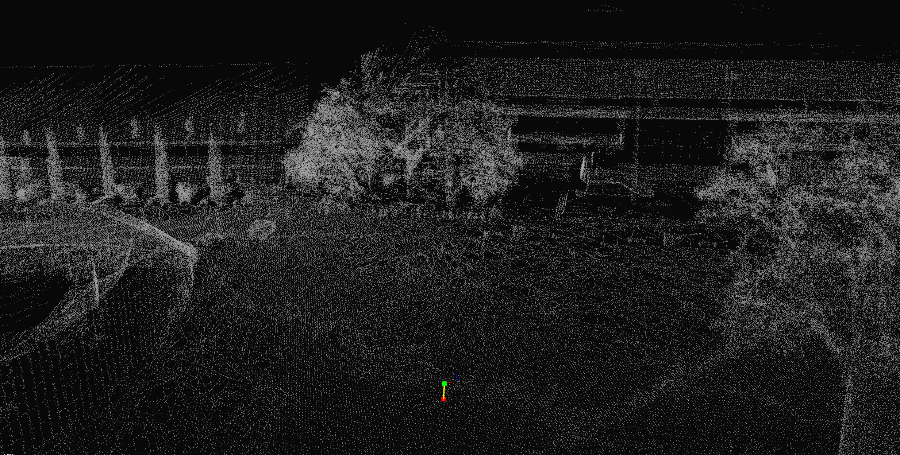

# likd-tree

**A Lightweight Incremental KD-Tree for Robotic Applications**

[](https://en.cppreference.com/w/cpp/17)
[](https://pypi.org/project/likd-tree/)
[](LICENSE)

`likd-tree` is a lightweight incremental KD-tree designed for dynamic point insertion with automatic rebalancing.

## C++ Version
Inspired by [ikd-tree](https://github.com/hku-mars/ikd-Tree), `likd-tree` is completely reimplemented using modern C++17 and features a more intelligent and principled rebalance strategy, which significantly improves efficiency while keeping the structure lightweight and easy to maintain.

## Python Version

**The python version likd-tree is also available now!🎉** 

To the best of our knowledge, this is the **first Python KD-tree library that supports incremental insertion with automatic rebuilding**. Install it via PyPI:
```bash
pip install likd-tree
```
For details see [Python Usage](#python-usage)

## 🚀 Key Features

- **🔄 Incremental**: Dynamic point insertion with automatic background rebalancing
- **🪶 Lightweight**: Header-only library (~450 lines of clean C++17) - no build required
- **⚡ Fast**: 2.44x faster incremental insertion than ikd-tree
- **🧠 Intelligent**: Smarter rebalance strategy with delayed and batched rebuilding of multiple non-overlapping unbalanced subtrees *(paper-worthy?)* 
- **🔧 Flexible**: Support for custom point types via PointTraits template - use any point representation (arrays, getters, etc.)

## 📊 Performance Comparison

Benchmark on 100K random 3D points (Intel CPU, -O3 optimization, with TBB parallel execution):

### Batch Build Performance
| Metric | likd-tree | ikd-tree | Speedup |
|--------|-----------|----------|---------|
| Build Time | 23.70 ms | 36.70 ms | **1.55x** |
| Query Time (1000 queries) | 1.23 ms | 1.30 ms | **1.06x** |

### Incremental Insertion Performance
100K points inserted in batches of 1000:

| Metric | likd-tree | ikd-tree | Speedup |
|--------|-----------|----------|---------|
| Total Insert Time | 84.04 ms | 151.82 ms | **1.81x**⭐ |
| Total Query Time | 17.37 ms | 71.38 ms | **4.11x**⭐  |


### Reproduce these results:
```bash
cmake -B build -DBUILD_BENCHMARK=ON
cmake --build build
./build/benchmark
```

## 🎯 Quick Start

### C++ Header-Only Usage

Simply include `likd_tree.hpp` in your project - no build or installation needed!

```cpp
#include <pcl/point_types.h>
// Define LIKD_TREE_USE_TBB BEFORE including the header to enable TBB parallel acceleration
#define LIKD_TREE_USE_TBB
#include "likd_tree.hpp"

using PointType = pcl::PointXYZ;

// Create tree
KDTree<PointType> tree;

// Build with initial points
PointVector<PointType> points = {...};
tree.build(points);

// Add more points incrementally
PointVector<PointType> new_points = {...};
tree.addPoints(new_points);

// Batch nearest neighbor queries
PointVector<PointType> queries = {...};
PointVector<PointType> results;
std::vector<float> distances;
tree.nearestNeighbors(queries, results, distances);
```

**To enable TBB parallel acceleration:**
- Add `#define LIKD_TREE_USE_TBB` before including `likd_tree.hpp`
- Link against TBB library in your build system (CMakeLists.txt or build script)

**To disable TBB (sequential execution):**
- Simply don't define `LIKD_TREE_USE_TBB`, or comment it out

### Custom Point Types

likd-tree supports arbitrary point types through the `PointTraits` template. By default, it works with point types that have `x`, `y`, `z` members, but you can easily customize it:

```cpp
// Your custom point type using an array
struct MyPoint {
  float coords[3];
};

// Specialize PointTraits for your point type
template <>
struct PointTraits<MyPoint> {
  static constexpr int DIM = 3;  // your custom point dimensionality
  
  static inline float coord(const MyPoint& pt, int axis) {
    return pt.coords[axis];
  }
  static inline float sqrDist(const MyPoint& a, const MyPoint& b) {
    float dx = a.coords[0] - b.coords[0];
    float dy = a.coords[1] - b.coords[1];
    float dz = a.coords[2] - b.coords[2];
    return dx * dx + dy * dy + dz * dz;
  }
};

// Use it like any other point type
KDTree<MyPoint> tree;
```

For detailed examples with different point representations (arrays, getters, etc.), see [test/demo.cpp](test/demo.cpp).


### Python Usage

Install via PyPI:
```bash
pip install likd_tree
```

Usage:

```python
import numpy as np
from likd_tree import KDTree

# Create and build tree
points = np.random.rand(10000, 3).astype(np.float32)
tree = KDTree()
tree.build(points)

# Query nearest neighbors
queries = np.random.rand(100, 3).astype(np.float32)
distances, indices = tree.nearest_neighbors(queries)

# Add more points incrementally
new_points = np.random.rand(1000, 3).astype(np.float32)
tree.add_points(new_points)

print(f"Tree size: {tree.size()}")
```

## 🛠️ Demo & Benchmark

### Run Demo

```bash
git clone https://github.com/scomup/likd-tree.git
cd likd-tree
cmake -B build
cmake --build build
./build/demo
```

### Nearest Neighbor Search on PCD

If PCL visualization is available, CMake also builds a PCD-based nearest
neighbor demo:

```bash
cmake -B build
cmake --build build --target nearest_search_pcd_demo
./build/nearest_search_pcd_demo <map.pcd> <qx> <qy> <qz>
```

Example:

```bash
./build/nearest_search_pcd_demo ./test/pcd/globalMap.pcd 0.9 0.1 0
```

The demo loads a PCD map, builds a `likd-tree`, queries the nearest point to
the input coordinate, and verifies the result with brute-force search.

Example output:

```text
Loaded points: 1742788
Finite points used: 1742788
Build time: 318.466372 ms
Query time: 0.010660 ms
Query: (0.900000, 0.100000, 0.000000)
Nearest: (0.950123, -0.076546, -1.369322)
Distance: 1.381566
Brute-force distance: 1.381566
Brute-force check: MATCH
```

In the visualization, the original cloud is shown in gray, the query point in
green, the nearest neighbor in red, and the line between them in yellow.



For terminal-only validation without opening a viewer, pass `--no-vis`:

```bash
./build/nearest_search_pcd_demo <map.pcd> <qx> <qy> <qz> --no-vis
```

### Run Benchmark (Compare with ikd-tree)

```bash
git clone https://github.com/scomup/likd-tree.git
cd likd-tree
cmake -B build -DBUILD_BENCHMARK=ON
cmake --build build
./build/benchmark
```

### Rebuild visualization demo

**Incremental add points without rebalance**

**Incremental add points with automatic rebalance**


**Note:** Benchmarks and demos require CMake to compile, but the library itself is pure header-only and needs no build step for integration into your project.

## 📋 TODO

**Planned Features:**
- [ ] Node deletion support (Node deletion not supported now)
- [ ] k-nearest neighbors (k-NN) query
- [ ] box/radius queries

> **Note:** If you require these features immediately, consider using [ikd-tree](https://github.com/hku-mars/ikd-Tree) instead.
