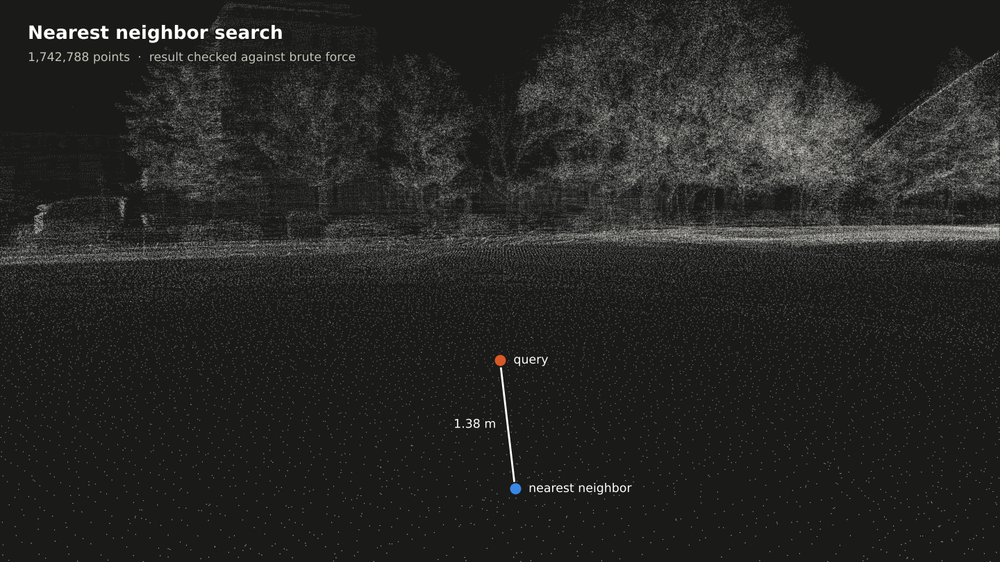
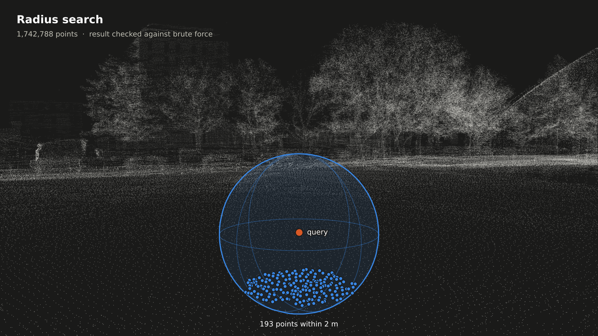

# likd-tree

**A Lightweight Incremental KD-Tree for Robotic Applications**

[](https://en.cppreference.com/w/cpp/17)
[](LICENSE)

`likd-tree` is a lightweight incremental KD-tree designed for dynamic point insertion with automatic rebalancing.

> This repository continues [scomup/likd-tree](https://github.com/scomup/likd-tree)
> by Liu Yang, which has had no updates since January 2026. It adds thread-safety
> fixes, k-NN and box search, point and box deletion, and a like-for-like
> benchmark against ikd-tree. See [License & Acknowledgements](#license--acknowledgements).

## C++ Version
Inspired by [ikd-tree](https://github.com/hku-mars/ikd-Tree), `likd-tree` is completely reimplemented using modern C++17 and features a more intelligent and principled rebalance strategy, which significantly improves efficiency while keeping the structure lightweight and easy to maintain.

## Python Version

**The python version likd-tree is also available now!🎉** 

To the best of our knowledge, this is the **first Python KD-tree library that supports incremental insertion with automatic rebuilding**. Install it via PyPI:
```bash
pip install likd-tree
```
For details see [Python Usage](#python-usage)

> **Note:** the `likd-tree` package on PyPI is the original author's 1.0.2
> release, and the bindings in `python/` still build that version. Neither
> includes the C++ changes in this repository yet.

## 🚀 Key Features

- **🔄 Incremental**: Dynamic point insertion and deletion (by point or by box) with automatic background rebalancing
- **🔍 Queries**: Nearest neighbor, k-nearest neighbors, radius and box search
- **🪶 Lightweight**: Header-only library (~1100 lines of C++17) - no build required
- **⚡ Fast**: On a 1.7M-point LiDAR map, 2.3x faster incremental insertion, 1.4x faster 5-NN search and 20x faster box deletion than ikd-tree
- **🧠 Intelligent**: Smarter rebalance strategy with delayed and batched rebuilding of multiple non-overlapping unbalanced subtrees *(paper-worthy?)* 
- **🔧 Flexible**: Support for custom point types via PointTraits template - use any point representation (arrays, getters, etc.)

## 📊 Performance Comparison

Both trees answer the same queries with the same threading (both sequential,
or both TBB-parallel). Each frame is queried against the map before it is
inserted, as in LiDAR odometry. AMD Ryzen 7 7700, GCC 9.4, -O3.

### Real LiDAR map
`test/pcd/globalMap.pcd` (1.74M points) streamed in file order, 2000-point frames:

| Metric | likd-tree | ikd-tree | Speedup |
|--------|-----------|----------|---------|
| Batch build, all points | 119 ms | 583 ms | **4.9x** |
| Insert, total | 1236 ms | 2786 ms | **2.3x** |
| Insert, worst frame | 8.9 ms | 54.9 ms | **6.2x** |
| 1-NN queries, sequential | 2081 ms | 2734 ms | **1.3x** |
| 5-NN queries, sequential | 3802 ms | 5278 ms | **1.4x** |
| 5-NN queries, TBB | 533 ms | 710 ms | **1.3x** |

Local map kept to a 100 m cube around the sensor, box deletion every 10 frames:

| Metric | likd-tree | ikd-tree | Speedup |
|--------|-----------|----------|---------|
| Box deletion, total | 13.6 ms | 293.5 ms | **21.6x** |
| Nodes in memory (78,334 valid points) | 78,338 | 236,611 | |

### 100K uniform random points
1000-point frames:

| Metric | likd-tree | ikd-tree | Speedup |
|--------|-----------|----------|---------|
| Insert, total | 34.5 ms | 84.9 ms | **2.5x** |
| 5-NN queries, sequential | 163.7 ms | 207.7 ms | **1.3x** |
| 5-NN queries, TBB | 24.6 ms | 28.0 ms | **1.1x** |

Earlier versions of this README compared TBB-parallel likd-tree queries with
sequential ikd-tree queries; the query numbers above are like-for-like.

### Reproduce these results:
```bash
cmake -B build -DBUILD_BENCHMARK=ON
cmake --build build
./build/benchmark                           # random points
./build/benchmark ./test/pcd/globalMap.pcd  # real map + local-map test
```

## 🎯 Quick Start

### C++ Header-Only Usage

Simply include `likd_tree.hpp` in your project - no build or installation needed!

```cpp
#include <pcl/point_types.h>
// Define LIKD_TREE_USE_TBB BEFORE including the header to enable TBB parallel acceleration
#define LIKD_TREE_USE_TBB
#include "likd_tree.hpp"

using PointType = pcl::PointXYZ;

// Create tree
KDTree<PointType> tree;

// Build with initial points
PointVector<PointType> points = {...};
tree.build(points);

// Add more points incrementally
PointVector<PointType> new_points = {...};
tree.addPoints(new_points);

// Batch nearest neighbor queries
PointVector<PointType> queries = {...};
PointVector<PointType> results;
std::vector<float> distances;
tree.nearestNeighbors(queries, results, distances);

// Single query: returns a copy of the point (std::optional) and its distance
PointType query;
auto [nearest, dist] = tree.nearestNeighbors(query);
if (nearest) { /* use nearest->x, ... */ }

// k nearest neighbors, sorted by distance (optionally within max_dist)
tree.knnSearch(query, 5, results, distances);

// Radius search
float radius = 2.0f;
tree.radiusSearch(query, radius, results, distances);

// Box search (boundary included)
KDTree<PointType>::AABB box({-1.0f, -1.0f, -1.0f}, {1.0f, 1.0f, 1.0f});
tree.boxSearch(box, results);

// Delete points (exact coordinates) or everything inside boxes
tree.deletePoints(points_to_remove);
tree.deleteBox(box);
```

**To enable TBB parallel acceleration:**
- Add `#define LIKD_TREE_USE_TBB` before including `likd_tree.hpp`
- Link against TBB library in your build system (CMakeLists.txt or build script)

**To disable TBB (sequential execution):**
- Simply don't define `LIKD_TREE_USE_TBB`, or comment it out

**Thread safety:**
- Queries can run from any number of threads, concurrently with writes.
- Writers (`build`, `addPoints`, `deletePoints`, `deleteBox(es)`) are serialized internally.
- Rebalancing runs on a background thread. Writes issued while it runs are
  queued and applied in order right after, so a query may briefly not see
  them. Call `waitForRebuild()` (or pass `wait_for_rebuild = true`) when they
  must be visible.

### Custom Point Types

likd-tree supports arbitrary point types through the `PointTraits` template. By default, it works with point types that have `x`, `y`, `z` members, but you can easily customize it:

```cpp
// Your custom point type using an array
struct MyPoint {
  float coords[3];
};

// Specialize PointTraits for your point type
template <>
struct PointTraits<MyPoint> {
  static constexpr int DIM = 3;  // your custom point dimensionality
  
  static inline float coord(const MyPoint& pt, int axis) {
    return pt.coords[axis];
  }
  static inline float sqrDist(const MyPoint& a, const MyPoint& b) {
    float dx = a.coords[0] - b.coords[0];
    float dy = a.coords[1] - b.coords[1];
    float dz = a.coords[2] - b.coords[2];
    return dx * dx + dy * dy + dz * dz;
  }
};

// Use it like any other point type
KDTree<MyPoint> tree;
```

For detailed examples with different point representations (arrays, getters, etc.), see [test/demo.cpp](test/demo.cpp).


### Python Usage

Install via PyPI:
```bash
pip install likd_tree
```

Usage:

```python
import numpy as np
from likd_tree import KDTree

# Create and build tree
points = np.random.rand(10000, 3).astype(np.float32)
tree = KDTree()
tree.build(points)

# Query nearest neighbors
queries = np.random.rand(100, 3).astype(np.float32)
distances, indices = tree.nearest_neighbors(queries)

# Add more points incrementally
new_points = np.random.rand(1000, 3).astype(np.float32)
tree.add_points(new_points)

print(f"Tree size: {tree.size()}")
```

## 🛠️ Demo & Benchmark

### Run Demo

```bash
git clone https://github.com/qiyu-lu/likd-tree.git
cd likd-tree
cmake -B build
cmake --build build
./build/demo
```

### Nearest Neighbor Search on PCD

If PCL visualization is available, CMake also builds PCD-based nearest
neighbor and radius search demos.

For nearest neighbor search:

```bash
cmake -B build
cmake --build build --target nearest_search_pcd_demo
./build/nearest_search_pcd_demo <map.pcd> <qx> <qy> <qz>
```

Example:

```bash
./build/nearest_search_pcd_demo ./test/pcd/globalMap.pcd 0.9 0.1 0
```

The demo loads a PCD map, builds a `likd-tree`, queries the nearest point to
the input coordinate, and verifies the result with brute-force search.

Example output:

```text
Loaded points: 1742788
Finite points used: 1742788
Build time: 318.466372 ms
Query time: 0.010660 ms
Query: (0.900000, 0.100000, 0.000000)
Nearest: (0.950123, -0.076546, -1.369322)
Distance: 1.381566
Brute-force distance: 1.381566
Brute-force check: MATCH
```

In the visualization, the original cloud is shown in gray, the query point in
green, the nearest neighbor in red, and the line between them in yellow:



For terminal-only validation without opening a viewer, pass `--no-vis`:

```bash
./build/nearest_search_pcd_demo <map.pcd> <qx> <qy> <qz> --no-vis
```

For radius search:

```bash
cmake -B build
cmake --build build --target radius_search_pcd_demo
./build/radius_search_pcd_demo <map.pcd> <qx> <qy> <qz> <radius>
```

Example:

```bash
./build/radius_search_pcd_demo ./test/pcd/globalMap.pcd 0.9 0.1 0 2.0
```

The radius demo prints the number of points found, validates the result with
brute-force search, and visualizes the query point in green, matched radius
points in red, and the search radius as a green wireframe sphere:



Example output:

```text
Loaded points: 1742788
Finite points used: 1742788
Build time: 330.332208 ms
Radius search time: 0.029950 ms
Query: (0.900000, 0.100000, 0.000000)
Radius: 2.000000
Radius search points: 193
Brute-force points: 193
Nearest radius result distance: 1.381566
Farthest radius result distance: 1.999513
Brute-force check: MATCH
```

For terminal-only validation:

```bash
./build/radius_search_pcd_demo <map.pcd> <qx> <qy> <qz> <radius> --no-vis
```

### Run Unit Tests

```bash
cmake -B build
cmake --build build
(cd build && ctest --output-on-failure)
```

The tests compare every query type against brute force, including random
mixes of insertion and deletion, and exercise concurrent readers and writers.

### Run Benchmark (Compare with ikd-tree)

```bash
git clone https://github.com/qiyu-lu/likd-tree.git
cd likd-tree
cmake -B build -DBUILD_BENCHMARK=ON
cmake --build build
./build/benchmark
```

### Rebuild visualization demo

**Incremental add points without rebalance**

**Incremental add points with automatic rebalance**


**Note:** Benchmarks and demos require CMake to compile, but the library itself is pure header-only and needs no build step for integration into your project.

## 📋 TODO

**Planned Features:**
- [x] Node deletion (by point and by box)
- [x] k-nearest neighbors (k-NN) query
- [x] box queries
- [ ] Python bindings for k-NN, radius/box search and deletion

## License & Acknowledgements

MIT, see [LICENSE](LICENSE). The original likd-tree is © 2026 Liu Yang
([scomup/likd-tree](https://github.com/scomup/likd-tree)); changes made in this
repository are © 2026 qiyu-lu.

The design is inspired by [ikd-Tree](https://github.com/hku-mars/ikd-Tree)
(GPL-2.0). The library contains no ikd-Tree code; only the benchmark builds
against it, pulled in as a git submodule.
