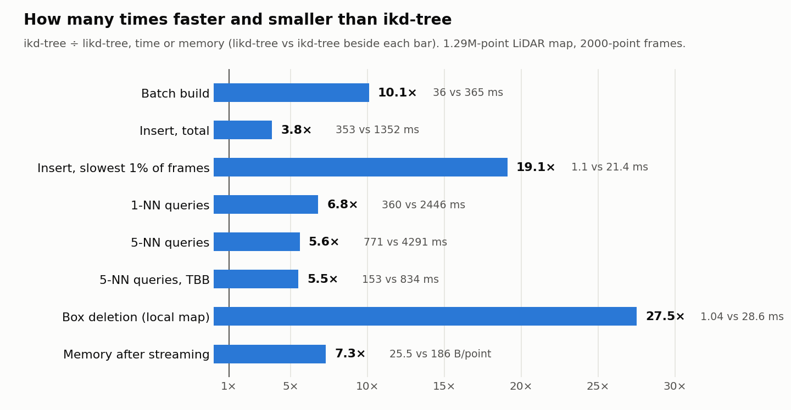

# likd-tree

**A Lightweight Incremental KD-Tree for Robotic Applications**

[](https://en.cppreference.com/w/cpp/17)
[](LICENSE)

`likd-tree` is a lightweight incremental KD-tree designed for dynamic point insertion with automatic rebalancing.

> This repository continues [scomup/likd-tree](https://github.com/scomup/likd-tree)
> by Liu Yang, which has had no updates since January 2026. It adds thread-safety
> fixes, k-NN and box search, point and box deletion, leaf buckets that cut
> memory per point by three quarters, and a like-for-like benchmark against
> ikd-tree. See [License & Acknowledgements](#license--acknowledgements).

## C++ Version
Inspired by [ikd-tree](https://github.com/hku-mars/ikd-Tree), `likd-tree` is completely reimplemented using modern C++17 and features a more intelligent and principled rebalance strategy, which significantly improves efficiency while keeping the structure lightweight and easy to maintain.

### Data structure

Points are stored in leaf buckets of up to 32 points, with a bit mask that
marks the deleted ones; inner nodes only split space. When a point is added
to a full leaf, the leaf is compacted if some of its points are deleted, and
otherwise split in two at the median of its points along their longest
extent. A batch build fills leaves to about 80%. Every node keeps the
bounding box of the points below it that are not deleted: searches prune
with it, and box deletion uses it to tag whole subtrees in O(1).

For `pcl::PointXYZ` this takes about 25 bytes per point. Earlier versions of
this repository used one 80-byte node per point (96 bytes with allocator
overhead); ikd-tree uses 160.

The leaf size is a compile-time option:

```cpp
struct MyOptions : DefaultOptions {
  static constexpr int LEAF_SIZE = 16;  // 2 to 64
};
KDTree<PointType, PointTraits<PointType>, MyOptions> tree;
```

The default is 32. On the benchmark maps, 64 saves another 10% of memory
but makes 5-NN queries up to 14% slower, and 16 needs about 31 bytes per
point.

[docs/design.md](docs/design.md) describes the layout, each operation, the
rebuild protocol and the rules that make it thread-safe.

## Python Version

**The python version likd-tree is also available now!🎉** 

To the best of our knowledge, this is the **first Python KD-tree library that supports incremental insertion with automatic rebuilding**. Install it via PyPI:
```bash
pip install likd-tree
```
For details see [Python Usage](#python-usage)

> **Note:** the `likd-tree` package on PyPI is the original author's 1.0.2
> release, and the bindings in `python/` still build that version, from their
> own older copy of the header (`python/src/likd_tree.hpp`). Neither includes
> the C++ changes in this repository yet.

## 🚀 Key Features

- **🔄 Incremental**: Dynamic point insertion and deletion (by point or by box) with automatic background rebalancing
- **🔍 Queries**: Nearest neighbor, k-nearest neighbors, radius and box search
- **⏱️ Time-aware (optional)**: Per-point stamps to refresh the points a scan sees again, expire those not seen for a while, and query only recent ones, in the spirit of Redis' LRU and TTL
- **🪶 Lightweight**: Header-only library (~2100 lines of C++17) - no build required
- **📦 Compact**: About 25 bytes per `pcl::PointXYZ` point, a sixth of ikd-tree's: points are stored in leaf buckets
- **⚡ Fast**: On a 1.3M-point LiDAR map streamed in scan-sized frames, 3.8x faster incremental insertion, 5.6x faster 5-NN search and 27x faster box deletion than ikd-tree
- **🧠 Intelligent**: Smarter rebalance strategy with delayed and batched rebuilding of multiple non-overlapping unbalanced subtrees *(paper-worthy?)* 
- **🔧 Flexible**: Support for custom point types via PointTraits template - use any point representation (arrays, getters, etc.)

## 📊 Performance Comparison



Both trees answer the same queries with the same threading (both sequential,
or both TBB-parallel). Each frame is queried against the map before it is
inserted, as in LiDAR odometry. Medians of 10 runs on an AMD Ryzen 7 7700,
GCC 9.4, -O3. Memory is the heap growth per point (glibc `mallinfo()`),
allocator overhead included.

### Real LiDAR maps
Both maps are streamed in file order, 2000-point frames. A frame of
`Global_map_sprase.pcd` (1.29M points) spans about 31 m, like a real scan.
`globalMap.pcd` (1.74M points) is stored in an order that makes each frame
span most of the map, so its streaming numbers resemble random insertion.

`Global_map_sprase.pcd`:

| Metric | likd-tree | ikd-tree | Speedup |
|--------|-----------|----------|---------|
| Batch build, all points | 36 ms | 365 ms | **10.1x** |
| Insert, total | 353 ms | 1352 ms | **3.8x** |
| Insert, slowest 1% of frames | 1.1 ms | 21.4 ms | **19.1x** |
| 1-NN queries, sequential | 360 ms | 2446 ms | **6.8x** |
| 5-NN queries, sequential | 771 ms | 4291 ms | **5.6x** |
| 5-NN queries, TBB | 153 ms | 834 ms | **5.5x** |
| Memory after batch build | 25.3 B/point | 160 B/point | |
| Memory after streaming | 25.5 B/point | 186 B/point | |

`globalMap.pcd`:

| Metric | likd-tree | ikd-tree | Speedup |
|--------|-----------|----------|---------|
| Batch build, all points | 54 ms | 579 ms | **10.6x** |
| Insert, total | 707 ms | 2621 ms | **3.7x** |
| Insert, slowest 1% of frames | 2.2 ms | 42.9 ms | **19.5x** |
| 1-NN queries, sequential | 1210 ms | 2751 ms | **2.3x** |
| 5-NN queries, sequential | 1934 ms | 5191 ms | **2.7x** |
| 5-NN queries, TBB | 299 ms | 712 ms | **2.4x** |
| Memory after batch build | 25.3 B/point | 160 B/point | |
| Memory after streaming | 28.1 B/point | 252 B/point | |

Local map kept to a 100 m cube around the sensor, box deletion every 10
frames, `Global_map_sprase.pcd`:

| Metric | likd-tree | ikd-tree | Speedup |
|--------|-----------|----------|---------|
| Box deletion, total | 1.04 ms | 28.6 ms | **27.5x** |
| Points stored, deleted ones included (105,921 kept) | 105,968 | 107,705 | |
| Memory per point kept | 26.2 B | 2272 B | |

### 100K uniform random points
1000-point frames:

| Metric | likd-tree | ikd-tree | Speedup |
|--------|-----------|----------|---------|
| Insert, total | 24.3 ms | 75.8 ms | **3.1x** |
| 5-NN queries, sequential | 80.2 ms | 191.0 ms | **2.4x** |
| 5-NN queries, TBB | 15.3 ms | 27.4 ms | **1.8x** |
| Memory after streaming | 29.5 B/point | 161 B/point | |

Earlier versions of this README compared TBB-parallel likd-tree queries with
sequential ikd-tree queries; the query numbers above are like-for-like.

The chart above is drawn by `python3 tools/plot_benchmark.py` from the
numbers in the first table.

### Reproduce these results:
```bash
cmake -B build -DBUILD_BENCHMARK=ON
cmake --build build
./build/benchmark                                    # random points
./build/benchmark ./test/pcd/Global_map_sprase.pcd   # real map + local-map test
./build/benchmark ./test/pcd/globalMap.pcd
```

## 🎯 Quick Start

### C++ Header-Only Usage

Simply include `likd_tree.hpp` in your project - no build or installation needed!

```cpp
#include <pcl/point_types.h>
// Define LIKD_TREE_USE_TBB BEFORE including the header to enable TBB parallel acceleration
#define LIKD_TREE_USE_TBB
#include "likd_tree.hpp"

using PointType = pcl::PointXYZ;

// Create tree
KDTree<PointType> tree;

// Build with initial points
PointVector<PointType> points = {...};
tree.build(points);

// Add more points incrementally
PointVector<PointType> new_points = {...};
tree.addPoints(new_points);

// Batch nearest neighbor queries
PointVector<PointType> queries = {...};
PointVector<PointType> results;
std::vector<float> distances;
tree.nearestNeighbors(queries, results, distances);

// Single query: returns a copy of the point (std::optional) and its distance
PointType query;
auto [nearest, dist] = tree.nearestNeighbors(query);
if (nearest) { /* use nearest->x, ... */ }

// k nearest neighbors, sorted by distance (optionally within max_dist)
tree.knnSearch(query, 5, results, distances);

// Radius search, nearest first
float radius = 2.0f;
tree.radiusSearch(query, radius, results, distances);

// Every query also takes SearchOptions; set its fields by name. Skipping
// the sort makes a radius search returning many points several times faster.
KDTree<PointType>::SearchOptions options;
options.sorted = false;  // radiusSearch: any order
tree.radiusSearch(query, radius, results, distances, options);
options.max_dist = 1.0f;  // knnSearch: only neighbors within 1 m
tree.knnSearch(query, 5, results, distances, options);

// Box search (boundary included)
KDTree<PointType>::AABB box({-1.0f, -1.0f, -1.0f}, {1.0f, 1.0f, 1.0f});
tree.boxSearch(box, results);

// Delete points (exact coordinates) or everything inside boxes
tree.deletePoints(points_to_remove);
tree.deleteBox(box);

// Points stored, and bytes held by the tree (including deleted points that
// a rebuild has not reclaimed yet)
int n = tree.size();
size_t bytes = tree.memoryUsage();
```

**Stamps (optional):** with `TRACK_STAMPS`, every point keeps a stamp, a
frame number or a time in any unit that never decreases or wraps.

```cpp
struct StampedOptions : DefaultOptions {
  static constexpr bool TRACK_STAMPS = true;
};
using StampedTree = KDTree<PointType, PointTraits<PointType>, StampedOptions>;
using Stamp = StampedTree::Stamp;

StampedTree map;
map.addPoints(scan, Stamp{frame});         // insert, stamped with the frame
map.touchPoints(neighbors, Stamp{frame});  // seen or used again: refresh
map.expireBefore(Stamp{frame - 100});      // drop what was not seen in 100 frames

StampedTree::SearchOptions recent;
recent.min_stamp = Stamp{frame - 10};      // only points seen in the last 10
map.knnSearch(query, 5, results, distances, recent);
```

- Points written without a stamp get `Stamp::kNever`, the largest value: they
  never expire, and `min_stamp` never hides them.
- `touchPoints` raises the stamp of every stored copy of each point (exact
  coordinates) and never lowers one. With copies of a point stamped
  differently, `deletePoints` removes the oldest.
- Touches and expiries are writes like the others: queued in order while a
  rebuild runs.
- Stamps cost about 5–7 bytes per point on the test maps, mostly 4 bytes per
  leaf slot. Without `TRACK_STAMPS`, the tree has the same layout and speed as
  before, and calling the functions above with a `Stamp`, or setting
  `min_stamp`, is a compile error.

**To enable TBB parallel acceleration:**
- Add `#define LIKD_TREE_USE_TBB` before including `likd_tree.hpp`
- Link against TBB library in your build system (CMakeLists.txt or build script)

**To disable TBB (sequential execution):**
- Simply don't define `LIKD_TREE_USE_TBB`, or comment it out

**Thread safety:**
- Queries can run from any number of threads, concurrently with writes.
- Writers (`build`, `addPoints`, `deletePoints`, `deleteBox(es)`) are serialized internally.
- Rebalancing runs on a background thread. Writes issued while it runs are
  queued and applied in order right after, so a query may briefly not see
  them. Call `waitForRebuild()` (or pass `wait_for_rebuild = true`) when they
  must be visible.
- A write call is applied in chunks of 2000 points (or boxes). Once a chunk
  leaves a subtree unbalanced, its rebuild starts and the rest of the call is
  queued behind it, so a call larger than that may return before all of it is
  visible. This keeps long runs of sorted or identical points from turning the
  tree into a chain.
- Known limitation: the queue has no bound. Writes issued back to back, with
  no pause between them, make it grow, and each write then takes longer to
  become visible. Calling `waitForRebuild()` from time to time keeps both in
  check.

**Upgrading from earlier versions of this repository:**
- `KDTree<...>::Node` is no longer public.
- `nodeCount()` now returns the number of points stored, including deleted
  points that a rebuild has not reclaimed yet; with leaf buckets it no longer
  reflects memory. Use `memoryUsage()` for that.

### Custom Point Types

likd-tree supports arbitrary point types through the `PointTraits` template. By default, it works with point types that have `x`, `y`, `z` members, but you can easily customize it:

```cpp
// Your custom point type using an array
struct MyPoint {
  float coords[3];
};

// Specialize PointTraits for your point type
template <>
struct PointTraits<MyPoint> {
  static constexpr int DIM = 3;  // your custom point dimensionality
  
  static inline float coord(const MyPoint& pt, int axis) {
    return pt.coords[axis];
  }
  static inline float sqrDist(const MyPoint& a, const MyPoint& b) {
    float dx = a.coords[0] - b.coords[0];
    float dy = a.coords[1] - b.coords[1];
    float dz = a.coords[2] - b.coords[2];
    return dx * dx + dy * dy + dz * dz;
  }
};

// Use it like any other point type
KDTree<MyPoint> tree;
```

The point type must be default-constructible and copy-assignable: leaves
store points in fixed-size arrays.

For detailed examples with different point representations (arrays, getters, etc.), see [test/demo.cpp](test/demo.cpp).


### Python Usage

Install via PyPI:
```bash
pip install likd_tree
```

Usage:

```python
import numpy as np
from likd_tree import KDTree

# Create and build tree
points = np.random.rand(10000, 3).astype(np.float32)
tree = KDTree()
tree.build(points)

# Query nearest neighbors
queries = np.random.rand(100, 3).astype(np.float32)
distances, indices = tree.nearest_neighbors(queries)

# Add more points incrementally
new_points = np.random.rand(1000, 3).astype(np.float32)
tree.add_points(new_points)

print(f"Tree size: {tree.size()}")
```

## 🛠️ Demo & Benchmark

### Run Demo

```bash
git clone https://github.com/qiyu-lu/likd-tree.git
cd likd-tree
cmake -B build
cmake --build build
./build/demo
```

### Nearest Neighbor Search on PCD

If PCL visualization is available, CMake also builds PCD-based nearest
neighbor and radius search demos.

For nearest neighbor search:

```bash
cmake -B build
cmake --build build --target nearest_search_pcd_demo
./build/nearest_search_pcd_demo <map.pcd> <qx> <qy> <qz>
```

Example:

```bash
./build/nearest_search_pcd_demo ./test/pcd/globalMap.pcd 0.9 0.1 0
```

The demo loads a PCD map, builds a `likd-tree`, queries the nearest point to
the input coordinate, and verifies the result with brute-force search.

Example output:

```text
Loaded points: 1742788
Finite points used: 1742788
Build time: 214.243788 ms
Query time: 0.003400 ms
Query: (0.900000, 0.100000, 0.000000)
Nearest: (0.950123, -0.076546, -1.369322)
Distance: 1.381566
Brute-force distance: 1.381566
Brute-force check: MATCH
```

The viewer shows the cloud in gray, the query point in green, the nearest
neighbor in red, and the line between them in yellow.

For terminal-only validation without opening a viewer, pass `--no-vis`:

```bash
./build/nearest_search_pcd_demo <map.pcd> <qx> <qy> <qz> --no-vis
```

For radius search:

```bash
cmake -B build
cmake --build build --target radius_search_pcd_demo
./build/radius_search_pcd_demo <map.pcd> <qx> <qy> <qz> <radius>
```

Example:

```bash
./build/radius_search_pcd_demo ./test/pcd/globalMap.pcd 0.9 0.1 0 2.0
```

The radius demo prints the number of points found, validates the result with
brute-force search, and visualizes the query point in green, matched radius
points in red, and the search radius as a green wireframe sphere.

Example output:

```text
Loaded points: 1742788
Finite points used: 1742788
Build time: 208.635532 ms
Radius search time: 0.013770 ms
Query: (0.900000, 0.100000, 0.000000)
Radius: 2.000000
Radius search points: 193
Brute-force points: 193
Nearest radius result distance: 1.381566
Farthest radius result distance: 1.999513
Brute-force check: MATCH
```

For terminal-only validation:

```bash
./build/radius_search_pcd_demo <map.pcd> <qx> <qy> <qz> <radius> --no-vis
```

### Run Unit Tests

```bash
cmake -B build
cmake --build build
(cd build && ctest --output-on-failure)
```

The tests compare every query type against brute force, including random
mixes of insertion and deletion, and exercise concurrent readers and writers.

### Run Benchmark (Compare with ikd-tree)

```bash
git clone https://github.com/qiyu-lu/likd-tree.git
cd likd-tree
cmake -B build -DBUILD_BENCHMARK=ON
cmake --build build
./build/benchmark
```

CMake gets ikd-Tree through the git submodule, or downloads it. Without
network access, compile against a local ikd-Tree checkout instead:

```bash
g++ -std=c++17 -O3 test/benchmark.cpp <ikd-Tree>/ikd-Tree/ikd_Tree.cpp \
  -I<ikd-Tree>/ikd-Tree -Isrc -I/usr/include/eigen3 -I/usr/include/pcl-1.10 \
  -lpcl_io -lpcl_common -lboost_system -ltbb -lpthread -o build/benchmark
```

Besides timings, the benchmark reports memory per point: heap growth from
glibc's `mallinfo()`, RSS growth, and `memoryUsage()`. It also defines
`LIKD_TREE_STATS`, so it reports the longest background rebuild and how long a
queued write waited before queries could see it. To compare against static
nanoflann trees (1.5.0 or newer) as well, pass
`-DNANOFLANN_INCLUDE_DIR=<dir>` to CMake, or add
`-DLIKD_BENCH_NANOFLANN -I<dir>` to the command above. Adding
`-DLIKD_BENCH_STAMPS` makes likd-tree keep stamps: Parts 1–3 then show what
they cost, Part 4 replays Part 2 touching each frame's 5-NN neighbors, and on
a map Part 5 replaces Part 3's box with a time to live of 50 frames.

**Comparing two versions.** Single runs on the same machine can differ by 10%
or more, so a few runs of each version can't show a 5% change.
Keep an executable built from the baseline, run it and the new one
alternately at least five times each, and compare the medians:

```bash
cp build/benchmark build/benchmark_base    # built from the baseline commit
# ...rebuild build/benchmark from the new version...
python3 test/compare_benchmarks.py build/benchmark_base build/benchmark \
    --map test/pcd/globalMap.pcd --runs 5
```

The script swaps which executable runs first every round. A process's first
large allocations, such as Part 1's build, depend on the process that ran
just before it: with the baseline always first, a build whose code had not
changed measured 5–11% slower, and 2–10% faster with the order reversed.

Passing the same executable twice shows the noise floor. The ikd-tree code is
identical in both executables, so its new/base ratio shows how much the
machine drifted during the comparison.

### Rebuild visualization demo

**Incremental add points without rebalance**

**Incremental add points with automatic rebalance**


**Note:** Benchmarks and demos require CMake to compile, but the library itself is pure header-only and needs no build step for integration into your project.

## 📋 TODO

**Planned Features:**
- [x] Node deletion (by point and by box)
- [x] k-nearest neighbors (k-NN) query
- [x] box queries
- [ ] Python bindings for k-NN, radius/box search and deletion

## License & Acknowledgements

MIT, see [LICENSE](LICENSE). The original likd-tree is © 2026 Liu Yang
([scomup/likd-tree](https://github.com/scomup/likd-tree)); changes made in this
repository are © 2026 qiyu-lu.

The design is inspired by [ikd-Tree](https://github.com/hku-mars/ikd-Tree)
(GPL-2.0). The library contains no ikd-Tree code; only the benchmark builds
against it, pulled in as a git submodule.
